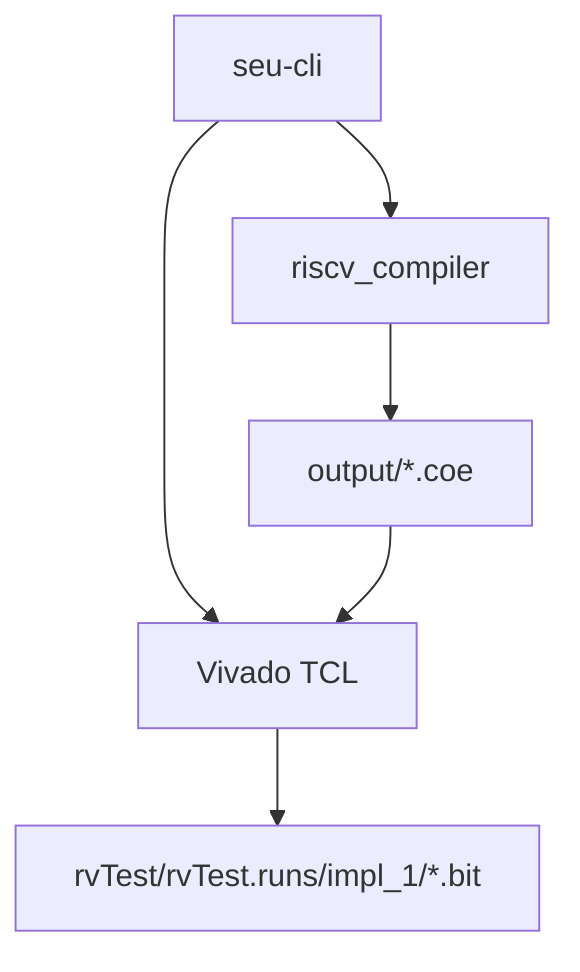

# 技术设计: Rust CLI 一键工具链

## 技术方案
### 核心技术
- Rust CLI: clap
- Vivado 调用: `vivado -mode batch -source <tcl>`

### 实现要点
- 增加 Rust 二进制入口，统一解析子命令与路径参数
- 复用现有编译器二进制，按子命令拼接参数
- 新增 Vivado TCL 脚本，分离 bitstream 与烧录两步
- 默认路径约定: 输入 `examples/`，输出 `output/`，Vivado 工程 `rvTest/`

## 架构设计

## 架构决策 ADR
### ADR-001: 采用单一 Rust CLI 二进制
**上下文:** 需要统一入口并避免外部脚本分散
**决策:** 在现有 Cargo 工程内新增 CLI 二进制，使用 clap 解析子命令
**理由:** 与现有 Rust 编译器集成成本最低，便于分发
**替代方案:** Bash 脚本集合 → 拒绝原因: 可维护性与跨平台提示能力不足
**影响:** 引入 clap 依赖并新增可执行文件

## API设计
### CLI 子命令
- `build`: 从 `.c` 生成 `.coe`
- `asm`: 从 `.s` 生成 `.coe`
- `bitstream`: 生成 bitstream
- `program`: 烧录 bitstream 到设备
- `all`: 完整流水线

## 数据模型
- 任务参数: 输入路径、输出路径、Vivado 工程路径、Vivado 安装路径

## 安全与性能
- **安全:** 明确区分生成与烧录命令，避免误操作
- **性能:** Vivado 调用采用 batch 模式，减少 GUI 依赖

## 测试与部署
- **测试:** 手工执行 CLI 子命令，验证 COE 与 bitstream 生成
- **部署:** 通过 `cargo build --release` 生成 CLI 二进制
