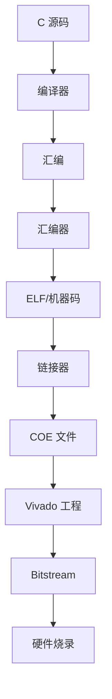
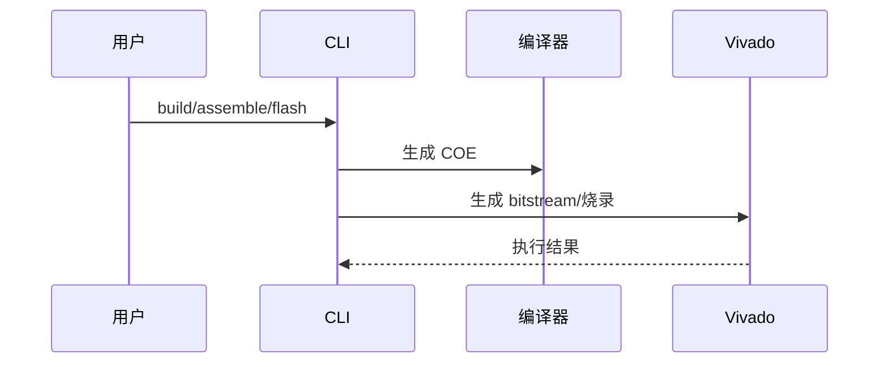

# 架构设计

## 总体架构

## 技术栈
- **编译链:** Rust
- **硬件:** Verilog + Vivado 2017.4
- **自动化:** Bash + TCL

## 核心流程

## 重大架构决策
完整的ADR存储在各变更的how.md中，本章节提供索引。

| adr_id | title | date | status | affected_modules | details |
|--------|-------|------|--------|------------------|---------|
| ADR-001 | Rust CLI 统一入口 | 2026-01-16 | ✅已采纳 | CLI 工具 | [记录](../history/2026-01/202601161908_cli_toolchain/how.md#adr-001-采用单一-rust-cli-二进制) |
| ADR-002 | Monaco Editor 替换编辑器 | 2026-01-16 | ✅已采纳 | IDE | [记录](../history/2026-01/202601161932_ide_rework/how.md#adr-002-monaco-editor-替换现有编辑器) |
