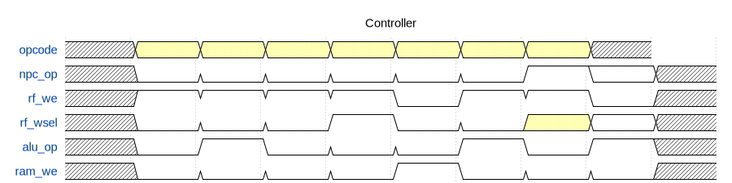
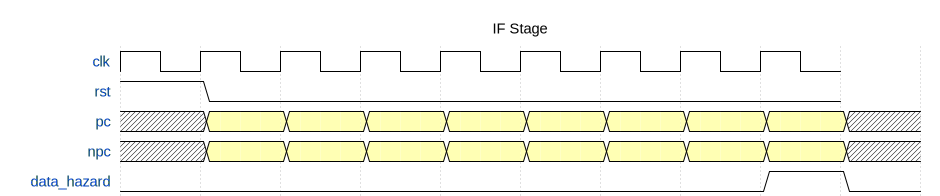
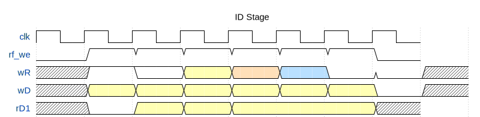

# RISC-V CPU 流水线各阶段仿真报告

## 概述

本文档记录了 miniRV CPU 五个模块的仿真测试结果及波形分析。

## 1. Controller 控制器模块

### 1.1 模块功能
控制器根据指令的 opcode、funct3、funct7 字段生成控制信号。

### 1.2 仿真结果

| 指令类型 | npc_op | rf_we | rf_wsel | alu_op | ram_we | sext_op |
|---------|--------|-------|---------|--------|--------|---------|
| R-ADD   | 000    | 1     | 000     | 000    | 0      | 000     |
| R-SUB   | 000    | 1     | 000     | 001    | 0      | 000     |
| I-ADDI  | 000    | 1     | 000     | 000    | 0      | 000     |
| I-LW    | 000    | 1     | 001     | 000    | 0      | 000     |
| S-SW    | 000    | 0     | 000     | 000    | 1      | 001     |
| B-BEQ   | 001    | 0     | 000     | 001    | 0      | 010     |
| U-LUI   | 000    | 1     | 011     | 001    | 0      | 011     |
| J-JAL   | 010    | 1     | 010     | 001    | 0      | 100     |

### 1.3 波形说明
- **opcode**: 指令操作码，决定指令类型
- **npc_op**: 下一PC选择 (000=PC+4, 001=BEQ, 010=JAL, 110=JALR)
- **rf_we**: 寄存器写使能，SW/B型指令为0
- **rf_wsel**: 写回数据选择 (000=ALU, 001=MEM, 010=PC+4, 011=SEXT)
- **alu_op**: ALU操作码
- **ram_we**: 存储器写使能，仅SW指令为1



---
## 2. IF 取指阶段

### 2.1 模块功能
IF阶段包含PC和NPC模块，负责生成指令地址。

### 2.2 关键信号

| 信号 | 含义 |
|-----|------|
| pc | 当前程序计数器 |
| npc | 下一条指令地址 |
| pc4 | PC+4 |
| npc_op | 跳转类型选择 |
| data_hazard | 数据冒险，PC暂停 |
| control_hazard | 控制冒险，PC跳转 |

### 2.3 测试用例结果

1. **顺序执行**: PC从0x04递增到0x0C，NPC=PC+4
2. **分支跳转**: BEQ成功时NPC=PC+offset-8
3. **无条件跳转**: JAL/JALR直接跳转
4. **冒险处理**: 
   - data_hazard=1时PC保持不变
   - control_hazard=1时PC立即更新



---

## 3. ID 译码阶段

### 3.1 模块功能
ID阶段包含RF(寄存器堆)和SEXT(符号扩展)模块。

### 3.2 寄存器堆测试

| 操作 | 寄存器 | 数据 | 结果 |
|-----|-------|------|------|
| 写入 | x1 | 0x1111 | 成功 |
| 写入 | x2 | 0x2222 | 成功 |
| 写入 | x0 | 0xFFFF | 无效(x0恒为0) |
| 读取 | x0 | - | 0x0000 |
| 读取 | x1 | - | 0x1111 |

### 3.3 SEXT符号扩展测试

| 类型 | 输入 | 输出 | 说明 |
|-----|------|------|------|
| I型 | 0x7FF | 0x000007FF | 正数扩展 |
| I型 | 0xFFF | 0xFFFFFFFF | 负数扩展 |
| S型 | - | 12位符号扩展 | |
| B型 | - | 13位符号扩展 | |
| U型 | - | 高20位 | |
| J型 | - | 21位符号扩展 | |



---
## 4. EX 执行阶段

### 4.1 模块功能
ALU执行算术逻辑运算，并产生分支比较结果。

### 4.2 ALU操作测试

| alu_op | 操作 | 示例输入 | 结果 |
|--------|-----|---------|------|
| 000 | ADD | 0x1234+0x5678 | 0x68AC |
| 001 | SUB | 0x5678-0x1234 | 0x4444 |
| 010 | AND | 0xFFFF&0x0000 | 0x0000 |
| 011 | OR  | 0xFF00|0x00FF | 0xFFFF |
| 100 | XOR | 0xAAAA^0xFFFF | 0x5555 |
| 101 | SLL | 0x01<<4 | 0x10 |
| 110 | SRL | 0x80000000>>4 | 0x08000000 |
| 111 | SRA | 0x80000000>>4 | 0xF8000000 |

### 4.3 分支条件信号(br)

| br值 | 含义 |
|-----|------|
| 00 | 相等 (rs1==rs2) |
| 01 | 小于 (rs1<rs2, 有符号) |
| 10 | 大于 (rs1>rs2, 有符号) |

### 4.4 波形分析
- alu_op变化时，alu_c输出立即计算新结果
- SUB操作同时产生br信号用于分支判断


---

## 5. MEM 访存阶段

### 5.1 模块功能
Bridge模块负责地址译码，将访问分发到DRAM或外设。

### 5.2 地址映射

| 地址范围 | 目标设备 |
|---------|---------|
| 0x0000_0000 - 0xFFFF_FBFF | DRAM |
| 0xFFFF_FC00 | 数码管 |
| 0xFFFF_FC60 | LED |
| 0xFFFF_FC70 | 开关 |
| 0xFFFF_FC78 | 按钮 |
| 0xFFFF_FC20 | 定时器 |

### 5.3 测试结果

1. **DRAM读写**: 写入0x12345678到地址0x00，读回正确
2. **外设写入**: 写数码管时we_dig=1, we_dram=0
3. **外设读取**: 读开关返回0x00AA


---
## 6. 仿真总结

### 6.1 测试结果汇总

| 模块 | 状态 | 测试用例数 |
|-----|------|-----------|
| Controller | ✅ 通过 | 22个指令 |
| IF Stage | ✅ 通过 | 10个场景 |
| ID Stage | ✅ 通过 | 15个场景 |
| EX Stage | ✅ 通过 | 25个操作 |
| MEM Stage | ✅ 通过 | 15个场景 |

### 6.2 文件列表

波形文件:
- controller_wave.svg
- if_wave.svg  
- id_wave.svg
- ex_wave.svg
- mem_wave.svg

仿真日志:
- controller_sim/controller_output.txt
- if_sim/if_output.txt
- id_sim/id_output.txt
- ex_sim/ex_output.txt
- mem_sim/mem_output.txt

### 6.3 如何查看波形

1. **使用GTKWave查看VCD文件**:
```bash
gtkwave controller_sim/controller_tb.vcd
```

2. **使用Vivado查看WDB文件**:
```bash
vivado -source open_wdb.tcl
```

3. **直接查看SVG波形图**:
用浏览器打开 *.svg 文件

---

*生成时间: 2026年1月7日*
