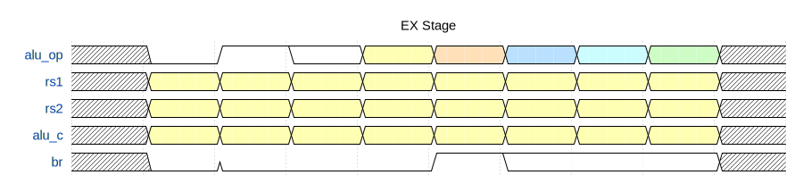
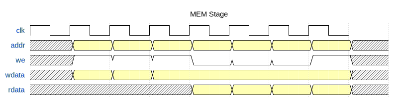

## 4. EX 执行阶段

### 4.1 模块功能
ALU执行算术逻辑运算，并产生分支比较结果。

### 4.2 ALU操作测试

| alu_op | 操作 | 示例输入 | 结果 |
|--------|-----|---------|------|
| 000 | ADD | 0x1234+0x5678 | 0x68AC |
| 001 | SUB | 0x5678-0x1234 | 0x4444 |
| 010 | AND | 0xFFFF&0x0000 | 0x0000 |
| 011 | OR  | 0xFF00|0x00FF | 0xFFFF |
| 100 | XOR | 0xAAAA^0xFFFF | 0x5555 |
| 101 | SLL | 0x01<<4 | 0x10 |
| 110 | SRL | 0x80000000>>4 | 0x08000000 |
| 111 | SRA | 0x80000000>>4 | 0xF8000000 |

### 4.3 分支条件信号(br)

| br值 | 含义 |
|-----|------|
| 00 | 相等 (rs1==rs2) |
| 01 | 小于 (rs1<rs2, 有符号) |
| 10 | 大于 (rs1>rs2, 有符号) |

### 4.4 波形分析
- alu_op变化时，alu_c输出立即计算新结果
- SUB操作同时产生br信号用于分支判断

---

## 5. MEM 访存阶段

### 5.1 模块功能
Bridge模块负责地址译码，将访问分发到DRAM或外设。

### 5.2 地址映射

| 地址范围 | 目标设备 |
|---------|---------|
| 0x0000_0000 - 0xFFFF_FBFF | DRAM |
| 0xFFFF_FC00 | 数码管 |
| 0xFFFF_FC60 | LED |
| 0xFFFF_FC70 | 开关 |
| 0xFFFF_FC78 | 按钮 |
| 0xFFFF_FC20 | 定时器 |

### 5.3 测试结果

1. **DRAM读写**: 写入0x12345678到地址0x00，读回正确
2. **外设写入**: 写数码管时we_dig=1, we_dram=0
3. **外设读取**: 读开关返回0x00AA

---
